# iDotMatrix Home Assistant Integration

Control an iDotMatrix RGB LED panel from Home Assistant over BLE, without any
dedicated bridge hardware or custom firmware. Ships a full sidebar panel
(gallery, albums, art catalog), two Lovelace cards, and a complete entity model.

## Screenshots

The sidebar panel (Settings-free: it registers itself):

| Home | Gallery |
|---|---|
| 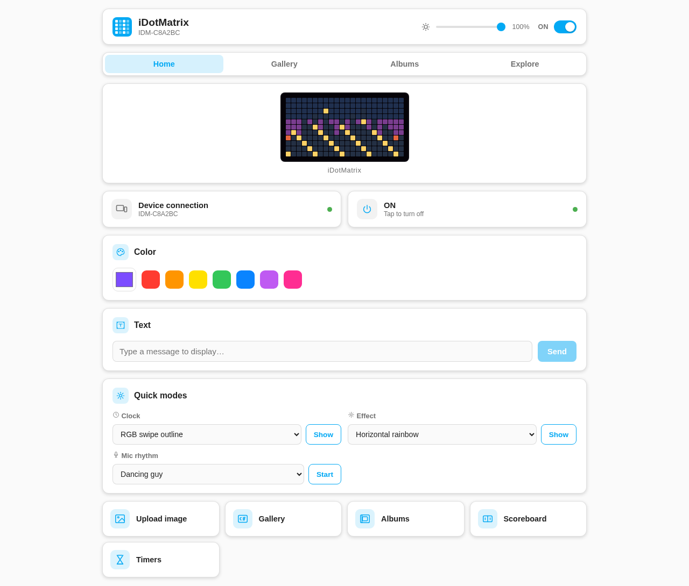 | 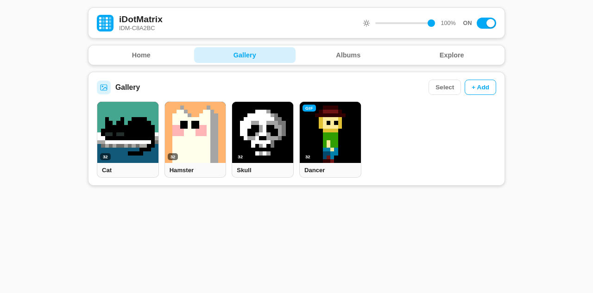 |

| Albums | Creating an album |
|---|---|
| 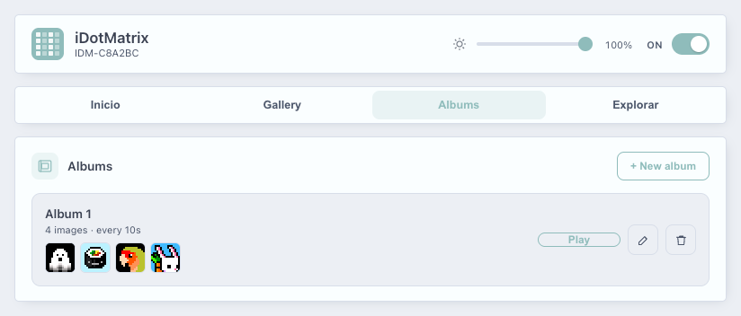 | 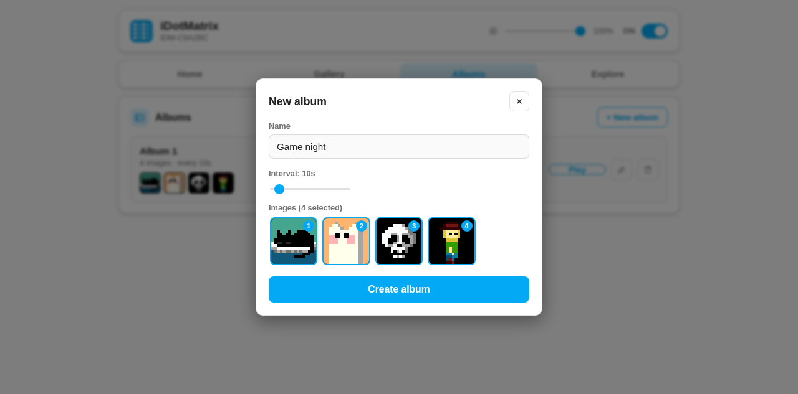 |

Browsing the app's own cloud art catalog (plus OpenMoji and Pokémon sources):

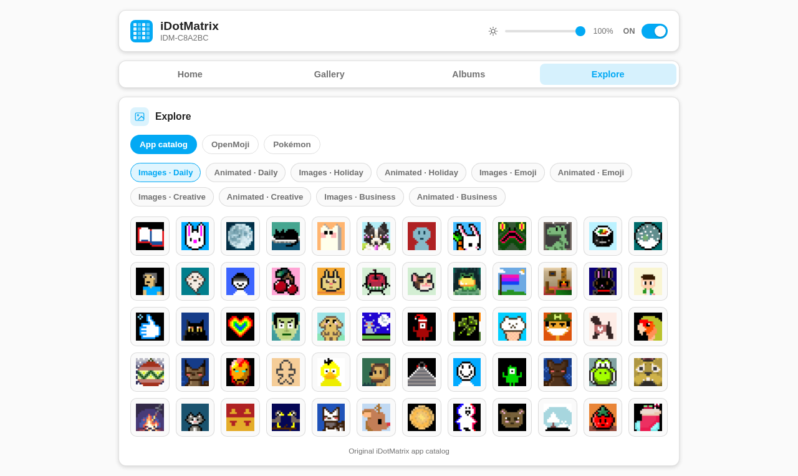

<b>More views</b> — modals, catalog animations, multi-select, Lovelace cards

| Upload from your PC | Catalog animations |
|---|---|
| 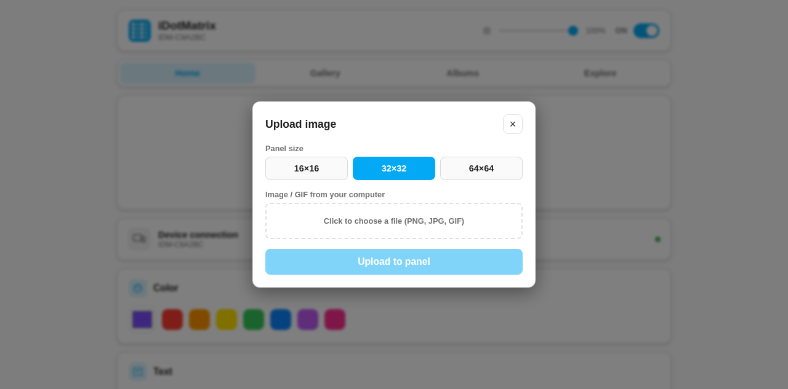 | 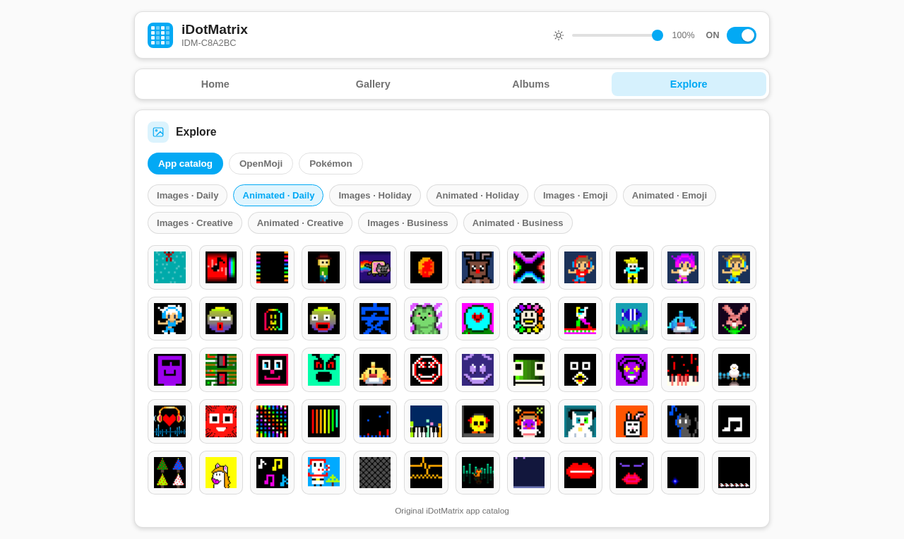 |

| Catalog item → panel/gallery | Scoreboard |
|---|---|
| 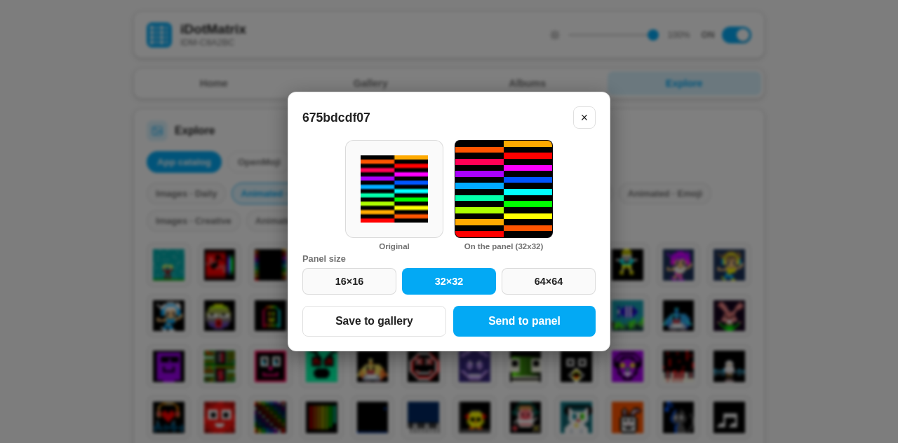 | 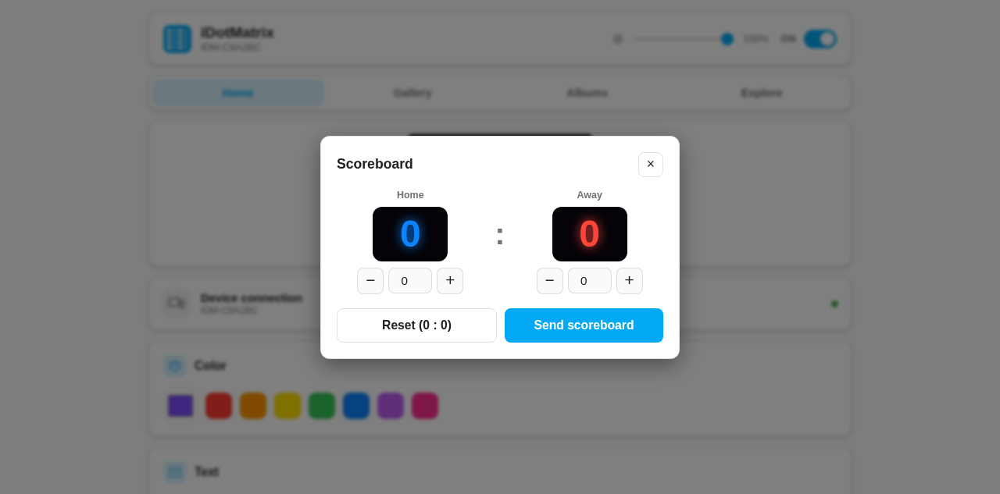 |

| Timers | Gallery multi-select |
|---|---|
| 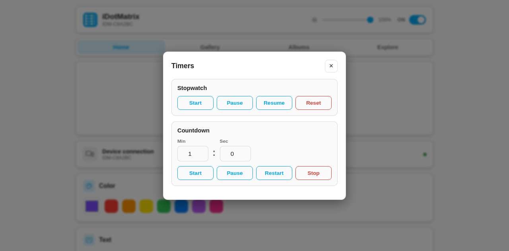 | 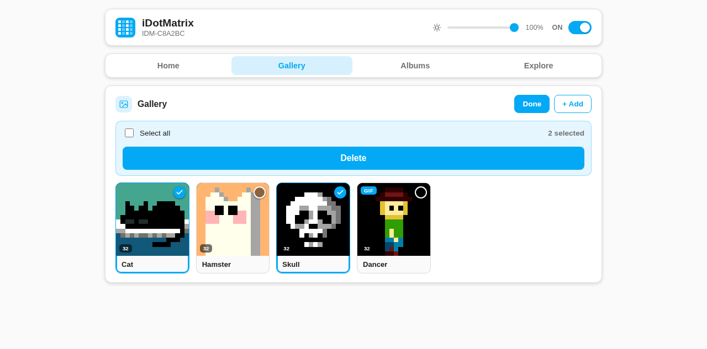 |

| Device-side album playing | Lovelace cards |
|---|---|
| 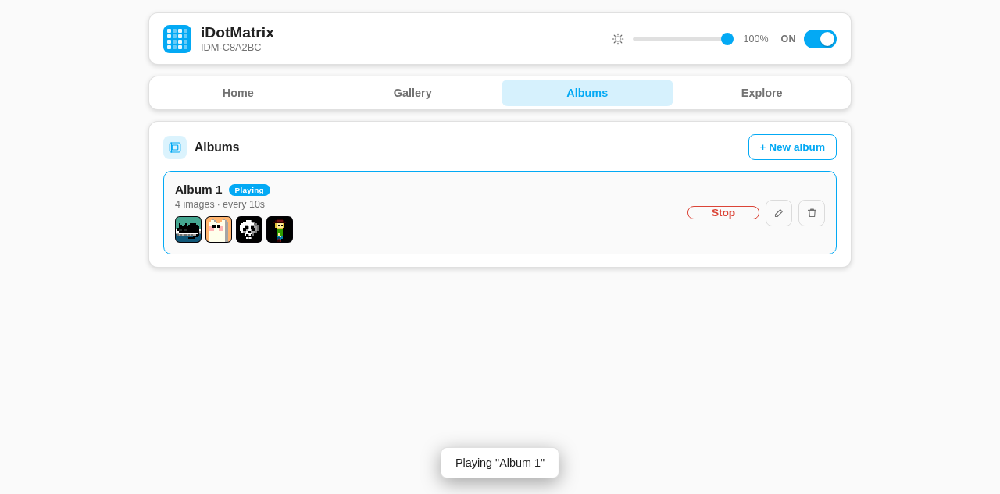 | 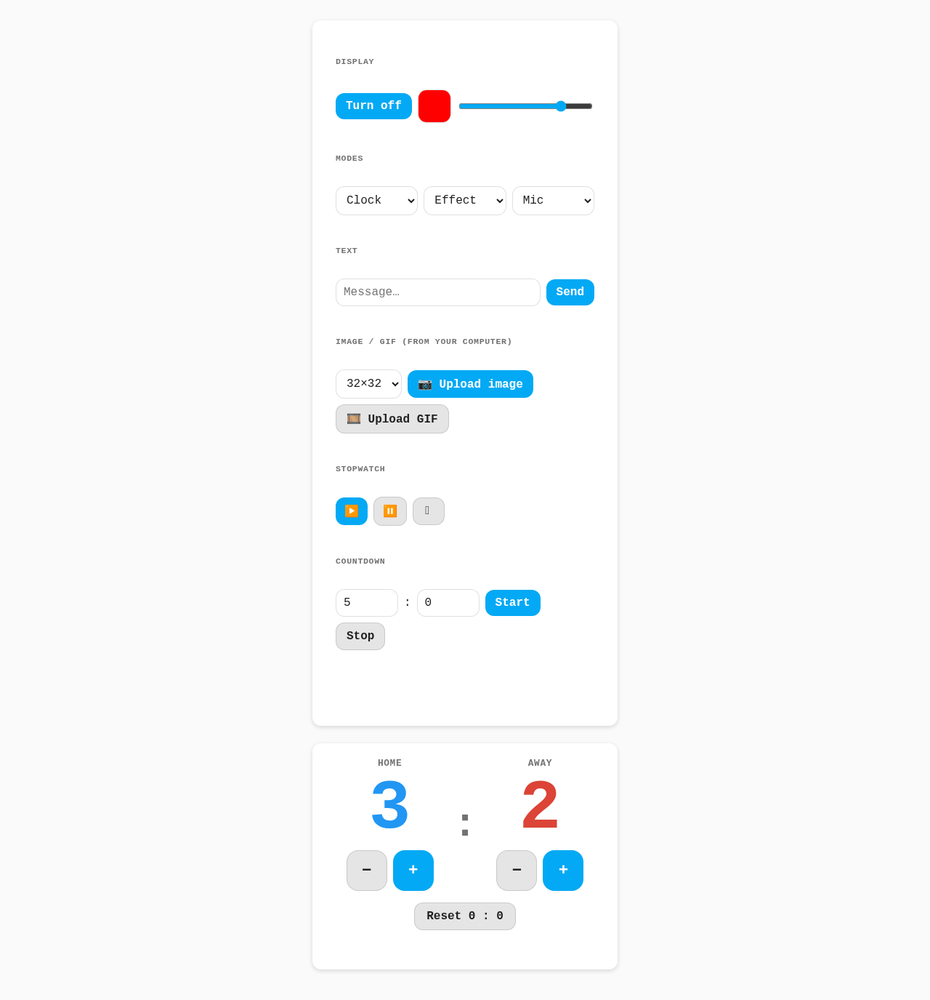 |

## How it works

This is a standard HA custom integration (`bleak` + HA's `bluetooth`
component). It resolves the panel's `BLEDevice` via
`homeassistant.components.bluetooth.async_ble_device_from_address()`, which
transparently routes the GATT connection through whichever adapter or active
Bluetooth proxy currently sees the panel — a local adapter, or a remote
ESPHome-API-compatible proxy (e.g. an ESPHome `bluetooth_proxy` with
`active: true`, or a WBRG1-style proxy). No firmware changes are needed on
any proxy device; this is the same mechanism `ha-tuya-ble` uses for Tuya BLE
thermometers.

## Requirements

- Home Assistant with at least one Bluetooth adapter or **active** BLE proxy
  in range of the panel (`bluetooth_proxy` + `active: true` in ESPHome, or an
  equivalent GATT-capable proxy).
- The panel must be powered on and advertising (device name prefix `IDM-`).

## Install

Copy `custom_components/idotmatrix/` into your HA `config/custom_components/`
directory (or install via HACS as a custom repository once published), then
restart HA. The panel should be auto-discovered; otherwise add it manually
via Settings → Devices & Services → Add Integration → iDotMatrix.

## What it exposes

One device with a proper entity model (no state can be read back from the
panel, so writable entities are marked `assumed_state`):

- **Light** — on/off + brightness (5-100% on the device, mapped to HA's
  0-255 range). Carries the entity services below.
  - `idotmatrix.upload_image` — any image Pillow can read, resized to the
    panel size (16/32/64) and uploaded.
  - `idotmatrix.upload_gif` — an animated GIF; frames are resized and
    re-encoded automatically.
  - `idotmatrix.send_text` — render and display a text message (9 scroll
    modes, speed, color mode, text/background color).
  - `idotmatrix.fullscreen_color` — fill the panel with one solid RGB color.
  - `idotmatrix.show_clock` — on-device clock (8 styles, date on/off, 12/24h,
    color).
  - `idotmatrix.show_effect` — built-in animated background (7 styles, 2-7
    color palette, speed 0-100).
  - `idotmatrix.chronograph` — stopwatch (reset/start/pause/resume).
  - `idotmatrix.countdown` — timer (start/stop/pause/restart, mm:ss).
  - `idotmatrix.scoreboard` — two counters (0-999 each).
  - `idotmatrix.set_eco_mode` — energy-saving auto-dim window (start/end
    time + eco brightness).
  - `idotmatrix.mic_rhythm` — on-device microphone reactive visualizer
    (style + sensitivity).
  - `idotmatrix.show_album` — switch back to the stored on-device album
    (carousel) without re-uploading anything.
  - `idotmatrix.stop_rhythm` — stop the audio rhythm visualizer.
- **Number: Screen-on time** — auto screen-off timeout.
- **Sensors (diagnostic): Firmware, Panel type, Panel size** — firmware read
  from the panel's version characteristic (with the auto-pushed device info as
  fallback); panel type decoded to pixel dimensions.

The panel's clock is synced to local time automatically on every connect.
- **Switch: Flip display** — 180° rotation (explicit on/off command).
- **Button: Reset** — general "fix the panel" command. Wipes content back to
  the default animations.
- **Number: Animation speed** — disabled by default; the command isn't
  referenced by the official app and likely only affects animated modes.

Availability follows BLE advertisements: the device shows unavailable when
no adapter/proxy has seen it recently.

## Architecture

- `protocol/` — pure byte-level protocol (no HA or BLE imports, unit-testable
  in isolation). Framing knowledge cross-checked against the archived
  original and the maintained fork.
- `client.py` — connection management on top of HA's Bluetooth stack:
  a lock serializes writes, every command is followed by a 0.5 s settle
  delay (the panel silently drops back-to-back writes), and the connection
  is released after 10 minutes idle so it doesn't permanently hold one of the
  proxy's limited connection slots.
- `availability.py` — advertisement-based availability via HA bluetooth
  callbacks.
- Thin entity platforms (`light`, `switch`, `button`, `number`, `sensor`) over
  a shared base entity.

## Preferred proxy

HA connects through the BLE proxy with the strongest signal, but the strongest
proxy isn't always the most reliable (some firmware handles connectable BLE
poorly). The integration's options (Settings → Devices & Services → iDotMatrix
→ Configure) let you pin a specific proxy for this panel instead of auto.

## Protocol notes

The command bytes were cross-checked against the community repos *and* a
disassembly of the official app (`com.tech.idotmatrix`). Two things that
differ from the community reverse-engineering and matter here:

- **There is no freeze command.** The app has no freeze/unfreeze feature; the
  community `04 00 03 00` frame freezes but the firmware never unfreezes from
  it. To hold a static display, upload an image.
- **Image pixels are raw R,G,B bytes** (not an encoded PNG), sent after
  enabling DIY mode as paced write-WITHOUT-response sub-chunks, ack-gated on
  the notify characteristic between 4 KB blocks. Large or un-paced writes are
  silently dropped (by ESPHome-style proxies and by the panel itself), which
  reads back as "everything succeeded" and a black screen.

See [docs/bluetooth-protocol.md](./docs/bluetooth-protocol.md) for the full
command catalog — including the persistent on-device album (carousel) format,
which took real hardware time to pin down.

## Validated against real hardware

Everything user-facing: power/brightness/flip, solid color, image and GIF
upload, text, clock/effects, chronograph/countdown/scoreboard, mic rhythm,
device-side albums (persistent carousel), and the cloud catalog — all on a
32×32 panel through ESPHome-style BLE proxies.

## In progress

On-device schedules (Programs) and alarms — protocol drafted from the
[ESP32 emulator project](https://github.com/piggei/IDotMatrix-ESP32-Emulator)'s
findings, pending hardware validation.

## Credits

Protocol reverse-engineered by the `derkalle4/python3-idotmatrix-library`
community (archived 2026-06-05), continued in
`Toon-nooT/idotmatrix-api-client` / `markusressel/python3-idotmatrix-library`
and `8none1/idotmatrix`, plus our own disassembly of the official app.
Cross-validated against two independent projects that reverse-engineered the
same hardware in parallel:
[`dallanwagz/idotmatrix-ha`](https://github.com/dallanwagz/idotmatrix-ha)
(golden-frame-tested protocol module; source of the firmware-version
characteristic, the panel-type size table, the DIY-mode enum names, and the
corrected effect framing) and
[`piggei/IDotMatrix-ESP32-Emulator`](https://github.com/piggei/IDotMatrix-ESP32-Emulator)
(device-side emulation; source of the schedule/alarm drafts).

## Documentation

Reverse-engineering notes and reference material live in [`docs/`](./docs/):

- [BLE protocol reference](./docs/bluetooth-protocol.md) — every command, framing, and gotcha.
- [Cloud catalog API](./docs/cloud-catalog.md) — the app's signed/encrypted art catalog and the asset-decode.
- [Integration architecture](./docs/architecture.md) — module layout and the tricky BLE behaviors.

These exist so anyone else reverse-engineering an iDotMatrix panel can find the
references we had to discover the hard way.
